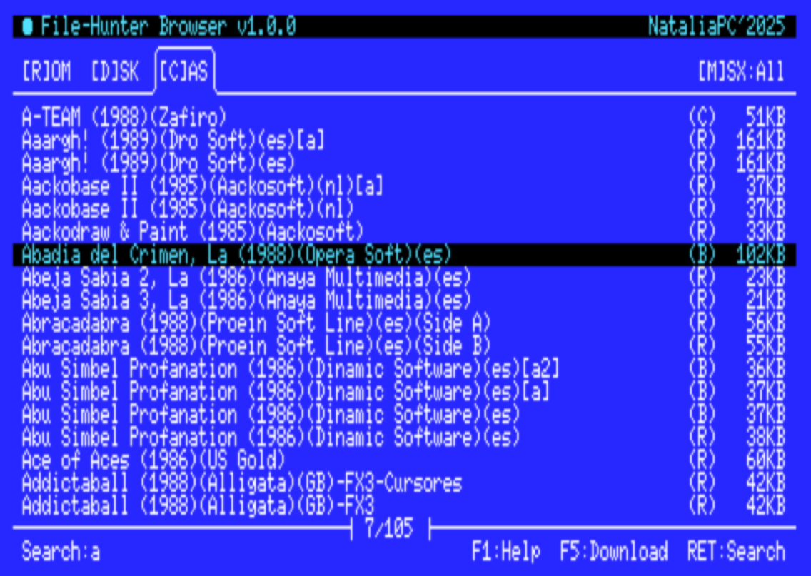

# File-Hunter Browser tool for MSX

**File-Hunter Browser** is a file browser and downloader that connects your MSX computer directly to the [file-hunter.com](https://file-hunter.com) MSX database.

You can search, browse and download ROM cartridges, disk images, cassette files and music directly to your MSX system over a network connection.



## Table of Contents
- [Features](#features)  
- [Requirements](#requirements)  
- [Search Filters](#search-filters)
- [Command Line Usage](#command-line-usage)
- [How to compile](#how-to-compile)  
- [Thanks](#thanks)  
- [License](#license)  

## Features
- **Direct file-hunter.com access**: Browse and download files from the largest MSX file database
- **Multiple file types**: Support for ROM, DSK, CAS and VGM files
- **MSX generation filtering**: Filter content by MSX1, MSX2, MSX2+ or Turbo-R compatibility
- **Search functionality**: Text-based search with real-time filtering
- **Network download**: Direct download to your MSX system via UNAPI TCP/IP
- **MSX2 optimized interface**: 80-column text mode with tabbed navigation

## Requirements
- MSX2 or higher  
- MSX-DOS 2.x (or Nextor)  
- UNAPI-compatible network device  

## Search Filters

### File Types
- **ROM**: Cartridge images (ROM files)
- **DSK**: Disk images (floppy disk files)  
- **CAS**: Cassette tape images
- **VGM**: Video Game Music files

### MSX Generation
- **All**: No generation filtering
- **1**: MSX1 compatible files only
- **2**: MSX2 compatible files only
- **2+**: MSX2+ compatible files only
- **Turbo-R**: MSX Turbo-R compatible files only

## Command Line Usage

Options to open the browser with a specific search configuration:

```bash
FH [/H][/M <gen>][/S <search>][/P <panel>]
```

### Options
- `/H` - Show help message and exit
- `/M <gen>` - Set MSX generation filter:
  - `1` - MSX1
  - `2` - MSX2  
  - `2+` - MSX2+
  - `turbo-r` - MSX Turbo-R
- `/P <panel>` - Set initial file type panel:
  - `rom` - ROM cartridges
  - `dsk` - Disk images
  - `cas` - Cassette files
  - `vgm` - Music files
- `/S <search>` - Set initial search string

### Examples
```bash
FH /M 2 /P dsk /S "konami"     # Search MSX2 disk images containing "konami"
FH /P rom /S "gradius"         # Search ROM files containing "gradius"
FH /M turbo-r                  # Browse Turbo-R compatible files
```

## How to compile

### Prerequisites to compile
- Linux  
- Docker (to run SDCC toolchain)  
- OpenMSX (optional, for emulation/testing)  

### Folder Structure
```
/bin           # helper scripts and tools
/contrib       # bundled libraries (UNAPI TCP/IP, etc)
/externals     # external projects (sdcc_msxdos, sdcc_msxconio)
/includes      # public headers
/libs          # compiled .lib archives
/src           # project source code
/obj           # build output (.rel, .ihx, .com)
/dsk           # generated disk images
```

### Compilation
```bash
git clone --recurse-submodules https://github.com/nataliapc/msx_filehunterbrowser.git
cd msx_filehunterbrowser
make all
```

## Thanks
Thanks to Arnaud de Klerk, @leomanes, @jom, and @ducasp.

## License
This project is licensed under the [MIT License](LICENSE).
